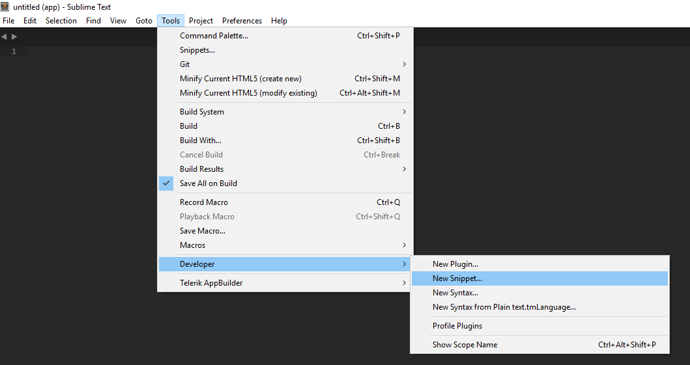
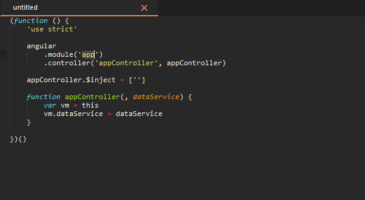

# Criando snippets no sublime

Para criar um novo snippet no sublime, vá em *tools* - *developers* - *new snippet*



O sublime irá gerar o seguinte trexo:

```xml
<snippet>
    <content><![CDATA[
Hello, ${1:this} is a ${2:snippet}.
]]></content>
    <!-- Optional: Set a tabTrigger to define how to trigger the snippet -->
    <!-- <tabTrigger>hello</tabTrigger> -->
    <!-- Optional: Set a scope to limit where the snippet will trigger -->
    <!-- <scope>source.python</scope> -->
</snippet>
```

Vamos criar um snippet para um controller padrão do angularJS:

```javascript
(function () {
    'use strict'

    angular
        .module('app')
        .controller('appController', appController)

    appController.$inject = ['$log']

    function appController($log, dataService) {
        var vm = this
        vm.dataService = dataService
    }

})()
```

Vamos adicionar nosso código a tag ```<content></content>```!
O snippet ficará assim:

```xml
<snippet>
    <content><![CDATA[
(function () {
    'use strict'

    angular
        .module('app')
        .controller('appController', appController)

    appController.\$inject = ['$log']

    function appController($log, dataService) {
        var vm = this
        vm.dataService = dataService
    }

})()
]]></content>
    <!-- Optional: Set a tabTrigger to define how to trigger the snippet -->
    <!-- <tabTrigger>hello</tabTrigger> -->
    <!-- Optional: Set a scope to limit where the snippet will trigger -->
    <!-- <scope>source.python</scope> -->
</snippet>
```
ps: Devido a utilização do $ para indexar a posição do ponteiro, quando o código possuir $, colocar uma \, que é o caso do ```$inject```

Vamos as edições!
O primeiro passo é entender o uso do ```${1:name}``` que ira posicionar para edição. Nesse exemplo, vamos precisar editar os seguintes elementos do código:

* Nome do modulo : ```${1:app}```
* Nome do Controller : ```${2:appController}```
* Serviço de dados : ```${3:dataService}```

```xml
<snippet>
    <content><![CDATA[
(function () {
    'use strict'

    angular
        .module('${1:app}')
        .controller('${2:appController}', ${2:appController})

    ${2:appController}.\$inject = ['$log']

    function ${2:appController}($log, ${3:dataService}) {
        var vm = this
        vm.dataService = ${3:dataService}
    }

})()
]]></content>
    <!-- Optional: Set a tabTrigger to define how to trigger the snippet -->
    <!-- <tabTrigger>hello</tabTrigger> -->
    <!-- Optional: Set a scope to limit where the snippet will trigger -->
    <!-- <scope>source.python</scope> -->
</snippet>
```

Quando chamarmos nosso snippet, o mesmo ira posicionar o editor no ponto do ```${1:name}``` e conforme por pressionando tab, ele vai navegando para ```${2:appController}``` e ```${3:dataService}```

Lembrando que o ```${2:appController}``` está em várias posições e conforme você editar, ele muda em todas ^^

Agora fora da tag ```<content></content>``` temos os sequintes atributos

```xml
    <tabTrigger></tabTrigger>
    <scope></scope>
```

tabTrigger é o nome que vamos dar para chamar nosso snippet, nesse caso **ngController**. O atributo scope, serve para determinar a linguagem que o snippet irá funcionar (caso você não informar nada, ele irá funcionar para qualquer linguagem). Nesse exemplo, vou determinar para *javascript*.

```xml
<snippet>
    <content><![CDATA[
(function () {
    'use strict'

    angular
        .module('${1:app}')
        .controller('${2:appController}', ${2:appController})

    ${2:appController}.\$inject = ['$log']

    function ${2:appController}($log, ${3:dataService}) {
        var vm = this
        vm.dataService = ${3:dataService}
    }

})()
]]></content>
    <tabTrigger>ngController</tabTrigger>
    <scope>source.js</scope>
</snippet>
```

Pronto! O código do nosso snippet está concluido.

Agora, precisamos salva-lo em *Packages/User* para poder utilizar o mesmo.

* Linux: ~/.config/sublime-text-3/Packages/Sublime Text 3/Packages\User
* Mac: ~/Library/Application Support/Sublime Text 3/Packages/User
* Windows: %APPDATA%/Sublime Text 3/Packages/Sublime Text 3/User

A extensão é um ponto **importante**, e deve ficar assim: nomedoarquivo.**sublime-snippet**

**Feito isso VOALAAAA!!!!**



Mais sobre snippet em: [Sublime Snippets](http://sublimetext.info/docs/en/extensibility/snippets.html)